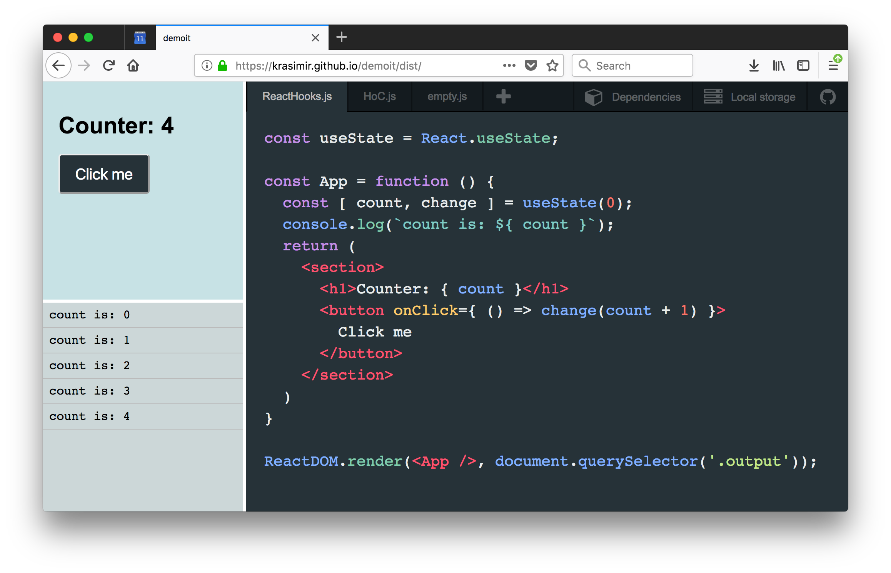

# **Demoit** is a small tool for live coding exercises <!-- omit in toc -->

* Dependency free.
* No installation.
* No server needed. Works offline.
* No building process.
* Uses Babel to transpile your code.
* Supports React.
* Supports multiple demos with multiple code snippets.
* Custom execution and rendering of the result.

## Demo

Check the demo here [https://krasimir.github.io/demoit/](https://krasimir.github.io/demoit/) :rocket:

---

## Installation

Just clone/download this repository and open `index.html` in a browser.

## Configuration

The tool requires a `settings.json` file in the same directory as the `index.html` file. Here is an example:

```json
{
  "editor": {
    "theme": "material",
    "fontSize": "20px",
    "lineHeight": "28px"
  },
  "output": {
    "backgroundColor": "#c7e2e5",
    "fontSize": "1em",
    "lineHeight": "1.2em"
  },
  "resources": [
    "./resources/babel-6.26.0.js",
    "./resources/babel-polyfill@6.26.0.js",
    "./resources/react-16.7.0-alpha.0.js",
    "./resources/react-dom.16.7.0-alpha.0.js",
    "./resources/renderers.js",
    "./demos/demo-styles.css"
  ],
  "demos": [
    {
      "snippets": [
        "./demos/01/useHooks.js",
        "./demos/01/HoC.js",
        "./demos/01/FaCC.js"
      ],
      "render": "babelToReact"
    }
  ]
}
```

* `editor` - settings for the right side of the screen - the editor.
  * `theme` - Demoit uses CodeMirror as an editor so here you can place some of its build-in themes. Check them out [here](https://codemirror.net/demo/theme.html).
  * `fontSize` - self explanatory
  * `lineHeight` - self explanatory
* `output` - settings for the left side of the screen
  * `backgroundColor` - self explanatory
  * `fontSize` - self explanatory
  * `lineHeight` - self explanatory
* `resources` - an array of files that your demo needs. This could be JavaScript or CSS files. They may be local or not. Demoit will fetch those first before running your demo files. The resources in the example above are coming with the library because you probably want to use them anyway. You probably want to write ES6+ and maybe plan to use React.
* `demos` - probably the most interesting part and the bit which you'll touch the most. It contains an array of items representing your demos. Every item has `snippets` and `render` properties. The first one contains list of files which are your code snippets. The `render` field points to a function in the global scope (i.e. `window` object) that Demoit uses when running your snippet. The one used above is part of the `resources/renderers.js` file which we listed as a resource to be included. The available values for now are `babelToCode`, `babelToConsole` and `babelToReact`.

## Rendering the result

When you register a code snippet Demoit runs a render function. The same happens when you _save_ your changes. The function receives your code as a first argument and a DOM element as second argument:

```js
function render(code, outputElement) {
  outputElement.innerHTML = `<pre>${ code }</pre>`;
}

```

This is the place where we have to decide what our demo is doing. We may only need to transpiler the code or in some other cases to actually run it. There are couple of build-in renderers:

* `babelToCode` - transpiles the code and shows the transpiled string. It is not actually running the code.
* `babelToConsole` - same as `babelToCode` but it runs the code and it shows all the `console.log`s.
* `babelToReact` - it transpiles the code snippet and mounts an `<App>` component in the left section of the screen. To have this working there must be an `<App>` component defined.

Let's see some pseudo code based on the real `babelToReact` implementation and see what it does:

```js
function babelToReact(str, outputElement) {
  const babelOptions = {
    presets: [ "react", ["es2015", { "modules": false }]]
  }
  let code = Babel.transform(str, babelOptions).code;
  let func = new Function('output', `
    ${ code }
    ReactDOM.render(React.createElement(App, null), output);
  `);

  func(outputElement);
}
```

It's pretty much composing our program in the form of a string and passing it to the `Function` constructor. At the end we simply run the newly created function.

## Key combinations

There is only one key combination - `Ctrl + S`/`Cmd + S` which is basically triggering the `render` function.

## UI

There is really not much to say here. There are two buttons of the lower left side of the tool. The first one shows a menu with all of our demos and code snippets in them. The second button becomes solid black if there are unsaved changes to our code. It also works as a button for saving but I guess clicking `Ctrl + S` or `Cmd + S` is quicker.

## Troubleshooting

### Error `URL scheme must be "http" or "https" for CORS request.`

It means that the browser doesn't load the files that the tool needs because the protocol is `file://`. That's a problem in Chrome at the moment. Everything works fine in Firefox. To fix the problem in Chrome you have to run it like so:

```
open /Applications/Google\ Chrome.app/ --args --disable-web-security
```
or under Windows:
```
chrome.exe --disable-web-security
```

Of course Demoit works just fine if you open `index.html` via `http` protocol but to do that you need a server.
